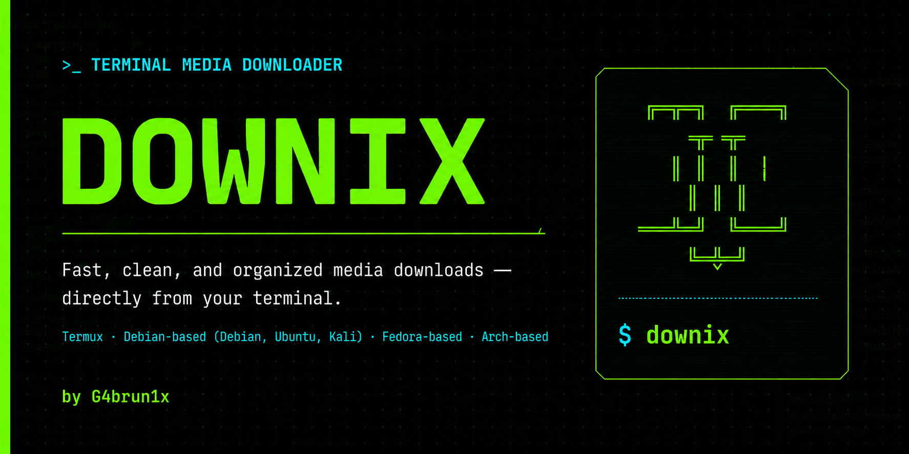

<div align="center">



# ⬇️ DOWNIX

### Descargador multimedia para Linux y Termux


**Descarga audio y video desde la terminal de forma rápida, sencilla y organizada.**

🎵 MP3 · 🎬 MP4 · 📺 Hasta 4K · 🌎 Español / English · 🐧 Linux · 📱 Termux

</div>

---

## 🚀 ¿Qué es Downix?

**Downix** es una herramienta de terminal diseñada para simplificar la descarga de contenido multimedia compatible con `yt-dlp`.

En lugar de utilizar comandos largos, Downix proporciona una interfaz interactiva donde solo tienes que:

```text
Pegar el enlace
      ↓
Elegir audio o video
      ↓
Seleccionar calidad
      ↓
Downix hace el resto
```

Los archivos descargados se organizan automáticamente en carpetas separadas para música y video.

---

## ✨ Características

| Función | Descripción |
|---|---|
| 🎵 Audio MP3 | Descarga y convierte audio automáticamente |
| 🎚️ Calidad MP3 | 128, 192, 256 y 320 kbps |
| 🎬 Video MP4 | Descarga videos en formato MP4 |
| 📺 Resolución | 480p, 720p, 1080p, 1440p, 2160p y mejor disponible |
| 📁 Organización | Separa automáticamente `Music` y `Video` |
| 🌐 Multimedia | Compatible con enlaces soportados por `yt-dlp` |
| 🔄 Actualización | Actualiza las dependencias desde el propio menú |
| 🌎 Idiomas | Español e inglés con preferencia persistente |
| 📱 Android | Integración con almacenamiento de Termux |
| 🐧 Linux | Compatible con múltiples distribuciones |
| 🛠️ Instalación automática | El instalador prepara las dependencias necesarias |
| ⚡ Terminal | Ligero y sin necesidad de interfaz gráfica |

---

# 📦 Instalación

## 📱 Termux / Android

Necesitas tener **Termux instalado desde F-Droid o GitHub**.

Copia y pega:

```bash
pkg update -y
pkg install git -y
git clone https://github.com/gabrunix/downix.git
cd downix
chmod +x install.sh
./install.sh
```

Durante la instalación, Downix puede solicitar acceso al almacenamiento de Android.

Acepta el permiso cuando aparezca.

Después ejecuta:

```bash
down
```

Y listo. ✅

---

## 🐧 Linux

Para Debian, Ubuntu, Kali Linux, Pop!_OS, Linux Mint, Fedora, Arch Linux, Manjaro y otras distribuciones compatibles:

```bash
git clone https://github.com/gabrunix/downix.git
cd downix
chmod +x install.sh
./install.sh
```

Después:

```bash
down
```

El instalador detectará automáticamente el entorno y preparará las dependencias necesarias.

---

## 🖥️ Menú principal

Al ejecutar:

```bash
down
```

verás:

```text
  ██████╗  ██████╗ ██╗    ██╗███╗   ██╗██╗██╗  ██╗
  ██╔══██╗██╔═══██╗██║    ██║████╗  ██║██║╚██╗██╔╝
  ██║  ██║██║   ██║██║ █╗ ██║██╔██╗ ██║██║ ╚███╔╝
  ██║  ██║██║   ██║██║███╗██║██║╚██╗██║██║ ██╔██╗
  ██████╔╝╚██████╔╝╚███╔███╔╝██║ ╚████║██║██╔╝ ██╗
  ╚═════╝  ╚═════╝  ╚══╝╚══╝ ╚═╝  ╚═══╝╚═╝╚═╝  ╚═╝

            by G4brun1x • Media Downloader

  ────────────────────────────────────────────────────

  [1] Descargar audio MP3
  [2] Descargar video MP4
  [3] Explorar archivos descargados
  [4] Actualizar dependencias
  [5] Cambiar idioma
  [0] Salir

  ────────────────────────────────────────────────────
```

---

# 🎵 Descargar audio MP3

Selecciona:

```text
[1] Descargar audio MP3
```

Pega un enlace compatible:

```text
URL: https://...
```

Luego selecciona la calidad:

```text
1) 128 kbps
2) 192 kbps
3) 256 kbps
4) 320 kbps
```

Downix descargará y convertirá automáticamente el archivo a MP3.

---

# 🎬 Descargar video MP4

Selecciona:

```text
[2] Descargar video MP4
```

Después elige la resolución:

```text
1) 2160p (4K)
2) 1440p
3) 1080p
4) 720p
5) 480p
6) Mejor disponible
```

Downix descargará la mejor combinación disponible de video y audio para la calidad seleccionada.

---

# 📂 Organización de las descargas

Downix mantiene los archivos organizados automáticamente.

### Linux

```text
~/Downloads/Downix/
├── Music/
└── Video/
```

### Termux / Android

```text
~/storage/shared/Download/Downix/
├── Music/
└── Video/
```

De esta forma tus archivos multimedia quedan accesibles también desde el explorador de archivos.

---

# 🔄 Actualizar dependencias

Desde el menú principal selecciona:

```text
[4] Actualizar dependencias
```

Downix comprobará y actualizará los componentes necesarios para mantener compatibilidad con los cambios de las plataformas multimedia.

También puedes ejecutar:

```bash
down --update
```

---

# 🔃 Actualizar Downix

Si ya tienes Downix instalado y quieres obtener una versión nueva del proyecto:

```bash
cd ~/downix
git pull
./install.sh
```

Esto actualizará el código de Downix y volverá a comprobar su entorno.

---

# 🌎 Cambiar idioma

Downix incluye interfaz en:

```text
🇪🇸 Español
🇺🇸 English
```

Selecciona:

```text
[5] Cambiar idioma
```

La opción seleccionada queda guardada para las siguientes ejecuciones.

---

# 🐧 Sistemas compatibles

Downix está diseñado para funcionar en sistemas Unix/Linux y Termux.

| Sistema | Soporte |
|---|:---:|
| 📱 Termux | ✅ |
| 🐉 Kali Linux | ✅ |
| 🌀 Debian | ✅ |
| 🟠 Ubuntu | ✅ |
| 🚀 Pop!_OS | ✅ |
| 🌿 Linux Mint | ✅ |
| 🔷 Fedora | ✅ |
| 🏹 Arch Linux | ✅ |
| 🟢 Manjaro | ✅ |
| 🐧 Otras distribuciones Linux | ⚙️ |

La compatibilidad final puede depender de los paquetes disponibles en cada distribución y de los cambios realizados por las plataformas multimedia.

---

# ⚙️ Tecnología utilizada

```text
                  ┌──────────────┐
                  │    DOWNIX    │
                  └──────┬───────┘
                         │
             ┌───────────┴───────────┐
             │                       │
         ┌───▼────┐              ┌───▼────┐
         │ yt-dlp │              │ FFmpeg │
         └───┬────┘              └───┬────┘
             │                       │
             └───────────┬───────────┘
                         │
                  ┌──────▼──────┐
                  │ Music/Video │
                  └─────────────┘
```

Downix utiliza principalmente:

```text
Bash
yt-dlp
yt-dlp-ejs
FFmpeg
Python
Deno
Git
```

El instalador se encarga de preparar el entorno necesario.

---

# 📁 Estructura del proyecto

```text
downix/
│
├── down
├── install.sh
├── uninstall.sh
│
├── README.md
├── CHANGELOG.md
├── CONTRIBUTING.md
├── SECURITY.md
├── THIRD_PARTY_NOTICES.md
├── LICENSE
├── .gitignore
│
├── assets/
│   └── downix-banner.png
│
└── docs/
    └── TROUBLESHOOTING.md
```

---

# 🗑️ Desinstalar Downix

Puedes ejecutar:

```bash
downix-uninstall
```

o desde la carpeta del proyecto:

```bash
./uninstall.sh
```

La desinstalación elimina los componentes instalados por Downix.

Tus archivos multimedia descargados se conservan.

---

# 🛣️ Próximas funciones

- [x] Descargas MP3
- [x] Descargas MP4
- [x] Selección de calidad de audio
- [x] Selección de resolución de video
- [x] Organización automática de archivos
- [x] Español e inglés
- [x] Termux
- [x] Linux
- [x] Actualización de dependencias
- [x] Integración con almacenamiento Android
- [ ] Historial de descargas
- [ ] Descargas por lotes
- [ ] Temas personalizados
- [ ] Mejor gestión opcional de cookies

---

# 🤝 Contribuciones

Las contribuciones son bienvenidas.

Puedes ayudar mediante:

- Reportes de errores
- Sugerencias
- Mejoras de código
- Compatibilidad con nuevas distribuciones
- Mejoras en documentación

Consulta:

```text
CONTRIBUTING.md
```

Para reportes relacionados con seguridad:

```text
SECURITY.md
```

---

# ⚖️ Aviso legal

Downix es una herramienta independiente y de código abierto.

Downix **no aloja, distribuye ni proporciona contenido multimedia**.

El programa utiliza herramientas externas como `yt-dlp` y `FFmpeg` para procesar enlaces proporcionados por el usuario.

El usuario es responsable de cumplir con:

- Los términos de servicio de las plataformas utilizadas.
- Las leyes de derechos de autor aplicables.
- Las regulaciones correspondientes de su país.

Utiliza Downix únicamente para descargar contenido propio, contenido de dominio público o contenido para el cual tengas autorización.

Downix no está afiliado con YouTube, Google, Instagram, Meta, Facebook, Pinterest, `yt-dlp`, FFmpeg ni con las plataformas compatibles.

Downix no está diseñado para eludir sistemas DRM.

---

# 📜 Licencia

Downix se distribuye bajo la licencia:

```text
MIT License
```

Consulta el archivo:

```text
LICENSE
```

para más información.

Las herramientas y dependencias externas mantienen sus respectivas licencias.

Consulta:

```text
THIRD_PARTY_NOTICES.md
```

---

# 👨‍💻 Autor

<div align="center">

### G4brun1x

**Gabriel Urbaez**

Desarrollo · Linux · Terminal · Open Source

GitHub: **[@gabrunix](https://github.com/gabrunix)**

---

### ⬇️ DOWNIX

**Simple. Rápido. Organizado. Desde la terminal.**

```bash
down
```

Copyright © 2026 G4brun1x

</div>
