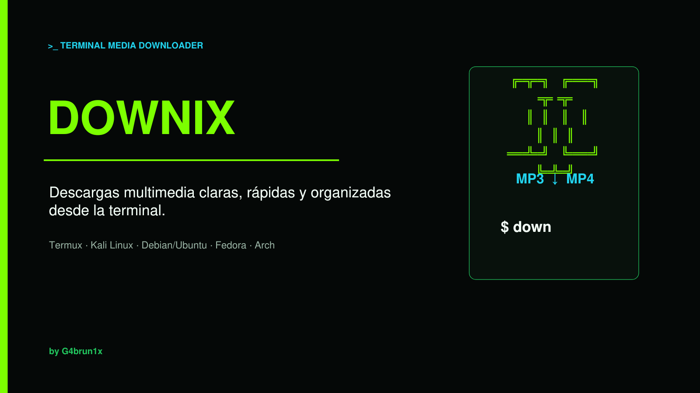

# Downix by G4brun1x



Terminal media downloader powered by `yt-dlp`, with Spanish and English interfaces.
Compatible with Termux (Android), Kali, Debian/Ubuntu, Fedora, and Arch Linux.

Downix provides a guided terminal experience for downloading authorized media,
choosing audio or video quality, organizing results, and opening Android storage.

## Features / Funciones

- Start command / Comando de inicio: `down`
- MP3 audio: 128, 192, 256, or 320 kbps
- MP4 video: 480p, 720p, 1080p, 1440p, 2160p, or best available
- Persistent Spanish/English language selector
- Professional dependency updater
- Exclusive fixed-width Downix wordmark on Termux, safe when zooming text
- Opens Android storage through the chosen file explorer
- Supports public links accepted by yt-dlp, including YouTube, Instagram,
  Facebook, and Pinterest

## Requirements / Requisitos

- Bash
- `yt-dlp`
- `ffmpeg`
- Python on Termux
- Storage permission on Android

## Download folders / Carpetas

```text
Download/
└── Downix/
    ├── Music/
    └── Video/
```

## Install / Instalar

```bash
chmod +x install.sh uninstall.sh down
./install.sh
```

On Android, stay in Downloads and run / En Android, permanece en Descargas y usa:

```bash
bash Downix-Installer/install.sh
```

Then run / Después ejecuta:

```bash
down
```

## Main menu / Menú principal

```text
[1] Audio MP3
[2] Video MP4
[3] Explorar descargas
[4] Actualizar dependencias
[5] Cambiar idioma
[0] Salir
```

On Termux, the temporary files and the `Downix-Installer` folder are removed
automatically after a successful installation.
En Termux, los archivos temporales y la carpeta `Downix-Installer` se eliminan
automáticamente después de una instalación correcta.

## Uninstall / Desinstalar

```bash
downix-uninstall
```

Downloaded files are never removed by the uninstaller.
El desinstalador nunca elimina las descargas.

Use Downix only for content you own or are authorized to download, and respect
each platform's rules. / Usa Downix únicamente con contenido propio o autorizado
y respeta las reglas de cada plataforma.

## Project files / Archivos del proyecto

```text
down                 Main application / Aplicación principal
install.sh           Cross-platform installer / Instalador
uninstall.sh         Safe uninstaller / Desinstalador
CHANGELOG.md         Release history / Historial
CONTRIBUTING.md      Contribution guide / Guía de colaboración
SECURITY.md          Security policy / Política de seguridad
LICENSE              MIT License / Licencia MIT
THIRD_PARTY_NOTICES.md  External dependencies / Dependencias externas
docs/                Documentation / Documentación
```

## License and authorship / Licencia y autoría

Downix is released under the MIT License.

Copyright © 2026 **G4brun1x (Gabriel Konstantinovich)**.

The copyright and permission notice must remain in copies or substantial
portions of the project. External dependencies retain their own licenses; see
[`THIRD_PARTY_NOTICES.md`](THIRD_PARTY_NOTICES.md).
